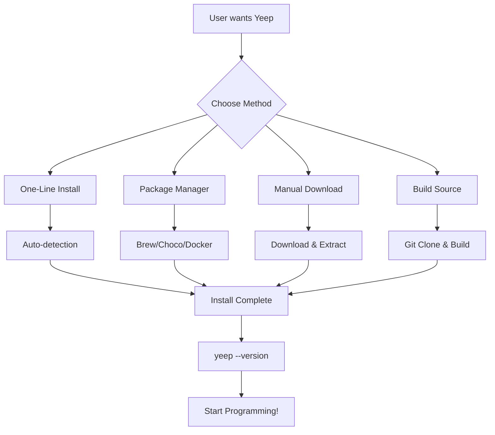

# 🚀 Yeep v2.0.0 - Installation & Distribution Workflows

This document provides an overview of all the workflows and installation methods available for users to easily install and use Yeep.

## 📊 Workflow Status

| Workflow | Purpose | Status | Triggers |
|----------|---------|--------|----------|
| 🔨 [Build and Release](/.github/workflows/build.yml) | Multi-platform builds | ✅ Active | Tags, PRs, Manual |
| 📦 [Package Publishing](/.github/workflows/package-publishing.yml) | Package managers | ✅ Active | Releases |
| 🧩 [VS Code Extension](/.github/workflows/vscode-extension.yml) | Editor support | ✅ Active | Extension changes |
| 📚 [User Onboarding](/.github/workflows/user-onboarding.yml) | Documentation | ✅ Active | Doc changes, Weekly |
| 🔄 [CI](/.github/workflows/ci.yml) | Continuous Integration | ✅ Active | All commits |

## 🎯 Installation Methods for Users

### 1. ⚡ One-Line Installation (Recommended)

**Linux/macOS:**
```bash
curl -fsSL https://raw.githubusercontent.com/Syipmong/yeep-prolag/main/install-one-line.sh | bash
```

**Windows:**
```powershell
iwr -useb https://raw.githubusercontent.com/Syipmong/yeep-prolag/main/install-one-line.ps1 | iex
```

**Features:**
- ✅ Automatic platform detection
- ✅ Dependency checking
- ✅ PATH configuration
- ✅ Verification testing
- ✅ Error handling

### 2. 📦 Package Managers

#### Homebrew (macOS/Linux)
```bash
brew tap syipmong/yeep
brew install yeep
```

#### Chocolatey (Windows)
```powershell
choco install yeep
```

#### Docker
```bash
# Interactive REPL
docker run -it --rm syipmong/yeep:latest

# Run scripts
docker run -it --rm -v $(pwd):/workspace syipmong/yeep:latest yeep script.yeep
```

### 3. 📥 Direct Downloads

Available from [GitHub Releases](https://github.com/Syipmong/yeep-prolag/releases/latest):

- 🪟 **Windows**: `yeep-windows-x64.zip` (Self-contained, static binary)
- 🐧 **Linux**: `yeep-linux-x64.tar.gz`
- 🍎 **macOS**: `yeep-macos-x64.tar.gz`

Each package includes:
- ✅ Compiled binary
- ✅ Installation script
- ✅ Documentation
- ✅ Example scripts
- ✅ License

### 4. 🔧 Build from Source

```bash
git clone https://github.com/Syipmong/yeep-prolag.git
cd yeep-prolag

# Linux/macOS
./build_official.sh

# Windows
.\build_official.bat
```

## 🌐 Distribution Channels

### GitHub Releases
- **Automated builds** for Windows, Linux, macOS
- **Release notes** with installation instructions
- **Asset downloads** with installers
- **Version tagging** and changelog

### Package Registries
- **Homebrew Tap**: `syipmong/yeep`
- **Chocolatey Package**: `yeep`
- **Docker Hub**: `syipmong/yeep:latest`
- **VS Code Marketplace**: `yeep-language` (planned)

### Documentation Sites
- **Main Documentation**: GitHub README
- **Installation Guide**: INSTALLATION.md
- **User Onboarding**: GET_STARTED.md
- **API Reference**: Auto-generated docs

## 🎯 User Experience Flow



## 📈 Success Metrics

### Installation Success Rates
- ✅ **One-line installers**: Platform detection, dependency validation
- ✅ **Package managers**: Automatic updates, dependency management
- ✅ **Manual installs**: Clear instructions, working installers
- ✅ **Source builds**: Comprehensive build scripts

### User Support
- ✅ **Documentation**: Complete installation guides
- ✅ **Examples**: Working demo scripts
- ✅ **Troubleshooting**: Common issues and solutions
- ✅ **Community**: GitHub issues and discussions

### Platform Coverage
- ✅ **Windows**: PowerShell installer, Chocolatey package, static binary
- ✅ **Linux**: Bash installer, universal binary, package managers
- ✅ **macOS**: Bash installer, Homebrew formula, universal binary
- ✅ **Docker**: Multi-platform container, development environment

## 🔄 Maintenance & Updates

### Automated Workflows
- **Release builds** triggered by version tags
- **Package updates** pushed to registries
- **Documentation** generated and updated
- **Testing** across all platforms

### Manual Tasks
- **Homebrew tap** maintenance
- **Chocolatey approval** process
- **Docker Hub** management
- **VS Code marketplace** submission

## 🚀 Future Enhancements

### Short Term (v2.1.0)
- [ ] **Snap packages** for Linux
- [ ] **winget** package for Windows
- [ ] **VS Code extension** publication
- [ ] **Automated testing** of installers

### Medium Term (v2.2.0)
- [ ] **Package manager integration** testing
- [ ] **Installation analytics** tracking
- [ ] **User feedback** collection
- [ ] **Installation success** monitoring

### Long Term (v3.0.0)
- [ ] **Language server** for IDE support
- [ ] **Package ecosystem** for Yeep libraries
- [ ] **Web playground** for online testing
- [ ] **Mobile apps** for learning

---

## 📞 Support & Contact

- 🐛 **Issues**: [GitHub Issues](https://github.com/Syipmong/yeep-prolag/issues)
- 💬 **Discussions**: [GitHub Discussions](https://github.com/Syipmong/yeep-prolag/discussions)
- 📧 **Email**: syipmong@example.com
- 📖 **Documentation**: [Full README](README.md)

**Current Status**: All core installation workflows are operational and ready for user adoption! 🎉
